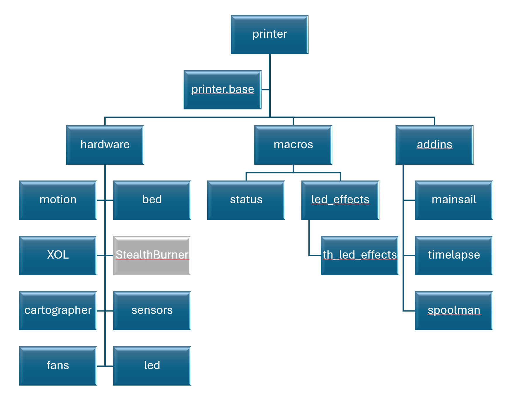
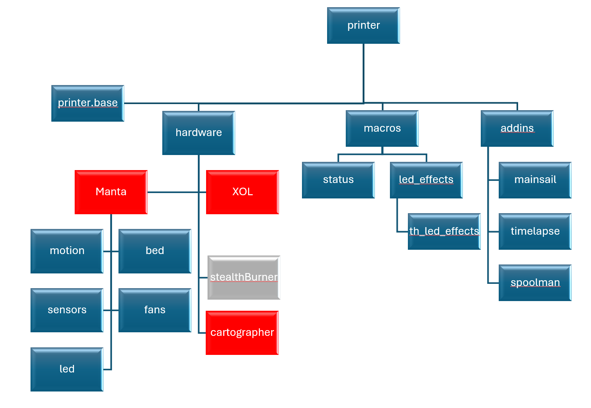

# Klipper Configs
## Methodology
Overall, I work hard to segregate things out into their individual constituant components.  Very much like Object Oriented programming, things should all be self contained inside their own entity.  This makes it (in theory) __very__ easy to remove something from your system and ONLY comment out that include file.  If you can not, then you have something wrong in your hierachy thinking.  I've done a LOT to try to enable this to function and NOT refer to other MCU pins that are NOT defined in your section.  It could be argued that some macros belong in more generalized areas, but if it deals with movement of the heads or moving the table/bed up/down, I believe THAT particular function belongs in `motion.cfg`.  
__All__ of the pin definitions for a given MCU should be in that area.  For example, there is an EBB36 MCU on the XOL toolhead.  All of the fans connected to that toolhead should be defined in there, of another file included from there like `xol_fans.cfg`.

You could argue that putting toolhead fans in the `xol.cfg` breaks the idea of a "universal" fans location in the `fans.cfg` and probalby you'd be right (and even toolhead led's are in the xol.cfg, but the chamber led's are in their own led.cfg).  Technically, I should have made a `manta.cfg` under `hardware.cfg` and then put `motion.cfg` and `fans.cfg` and `bed.cfg` all below that, and you could then have fans and led below XOL as well to be more clear.  Here, each item in :red_circle:red:red_circle: has it's own MCU on the canbus.  I may still move toward that, with something like the following:

But as it stands now, to swap between StealthBurner.cfg and XOL.cfg toolhead, even with all the different toolhead MCU boards, different fans and pin defs and stuff, it is as simple as comment __OUT__ `XOL.cfg` and uncomment `stealthburner.cfg`.  And all of the `[input shapper]` and hotend PID heater tunes go in each toolhead config.  NOT in `printer.cfg`

## The Repos
- [FlashForge Adventurer 5MPro](FlashForge%20Adventurer%205MPro)

- [Siboor AWD Trident 350mm](Siboor%20AWD%20Trident%20350mm)
