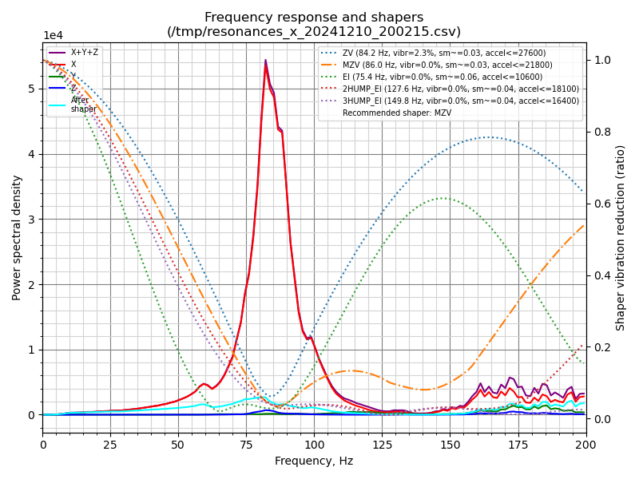
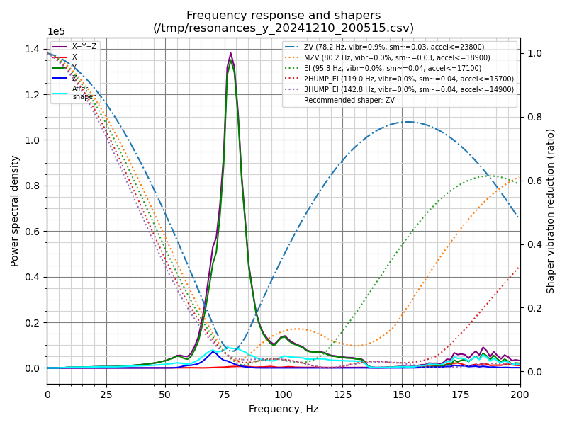
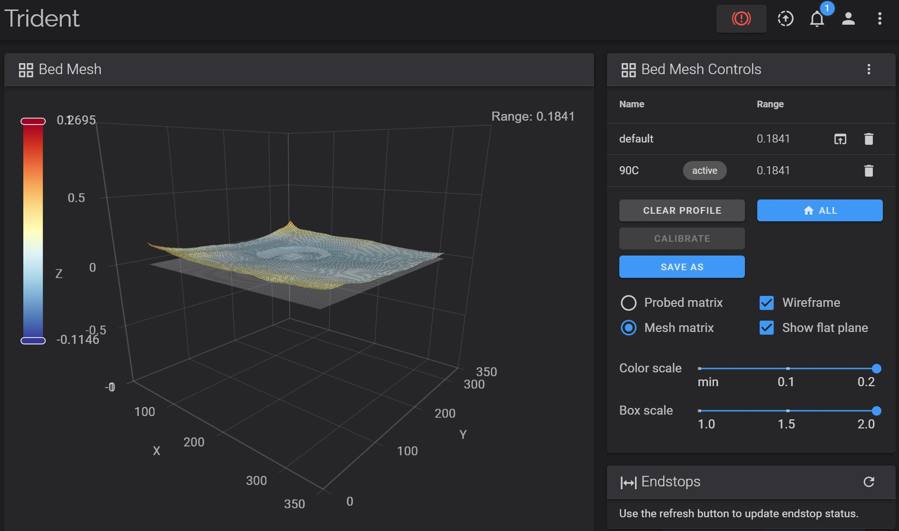
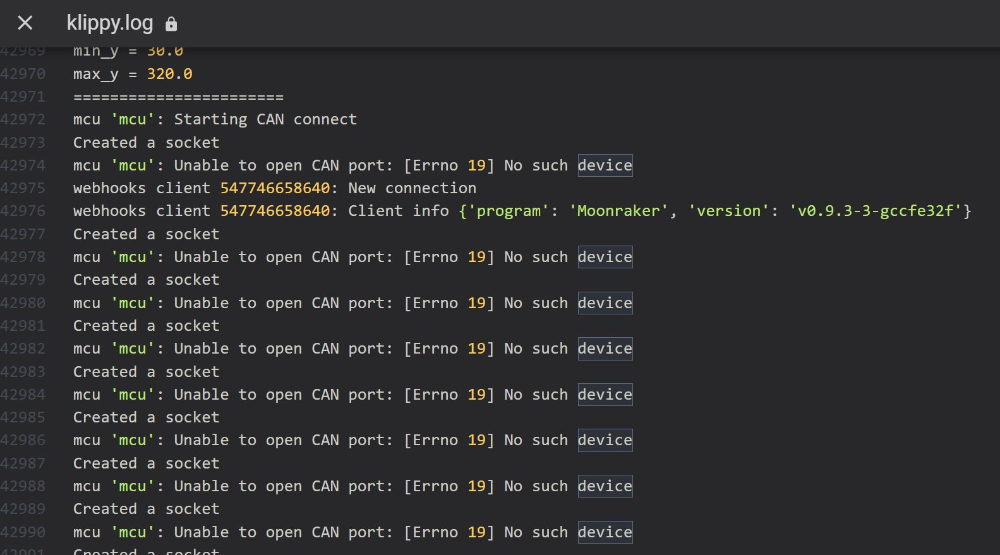
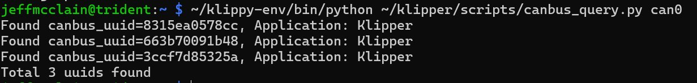

# The Build
| Item | Description | Images |
| ---------------  | ------------------------------------------- | ---------------------------------------|
| [Manta M8p v2](https://github.com/bigtreetech/Manta-M8P) and CM4 prep | I went ahead and flashed new OS image for the CM4 and got all the Klipper, Fluidd, Mainsail, Moonraker, Crowsnest, Spoolman stuff setup with [kiauh](https://github.com/dw-0/kiauh) script |   |
| 2020 Frame | Built the frame on a nice, flat granite counter-top and used blue loc-tite on all the extrusion screws.  Careful to measure diagonals and keep square and measure gantry and ensure parallel to bottom. |  |
| Gantry | Construction of the CNC Aluminum mounts and rails as well as the AWD motor system |    |
| Bed | 1000W bed heater and magnetic pad on the 350mm Aluminum block |    |
| Electronics | Lots of stuff in here.  Started with HV/AC routing, and I wish I could have kept the HV lines in separate channel from LV wiring. Had to redrill/tap most of the holes in the bottom panel to allow the 48v/5v PSUs in addition to the stock 24v PSU |    |
| Panels | Door panel construction was very confusing on the orientation for the right fit with the seals, but got it. [Annex-Eng Panel clips](https://github.com/Annex-Engineering/Annex-Engineering_User_Mods/tree/main/Printers/All_Printers/annex_dev-Panel_2020_Clips_and_Hinges) MOD was money and I LOVE the [Clicky-Clacky Fridge door](https://github.com/tanaes/whopping_Voron_mods/tree/main/clickyclacky_door) MOD included in this kit |   |
| Misc | Firmware installation of canbus was VERY painful, but mostly because the Manta guide didn't really address it.  [Esoterical Canbus Guide](https://canbus.esoterical.online/) was a HUGE help here. |   |
