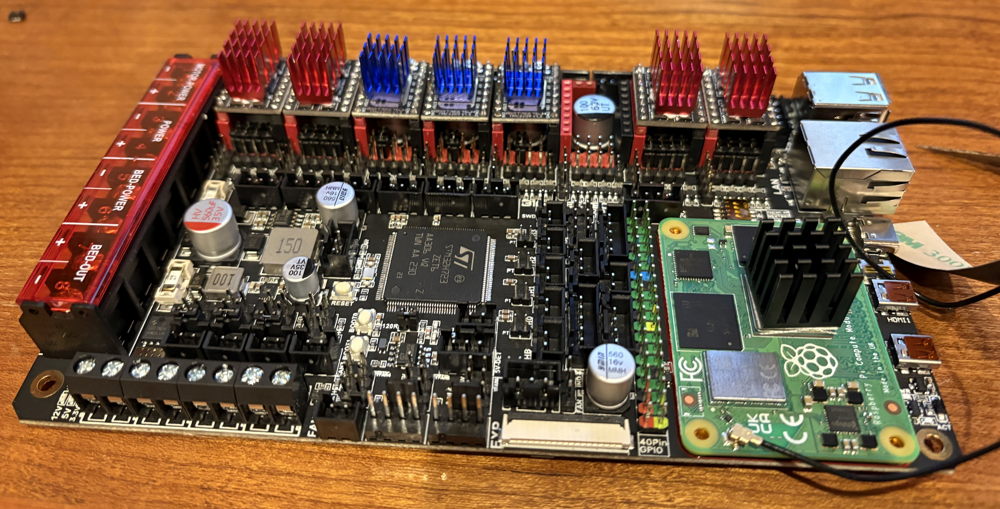

# The Build
| Item | Description | Images |
| ---------------  | ------------------------------------------- | ---------------------------------------|
| [Manta M8p v2](https://github.com/bigtreetech/Manta-M8P) and CM4 prep | I went ahead and flashed new OS image for the CM4 and got all the Klipper, Fluidd, Mainsail, Moonraker, Crowsnest, Spoolman stuff setup with [kiauh](https://github.com/dw-0/kiauh) script |   |
| 2020 Frame | |  |
| Gantry | |  |
| Bed | |   |
| Electronics | |  |
| Panels | |   |
| Misc | | |
