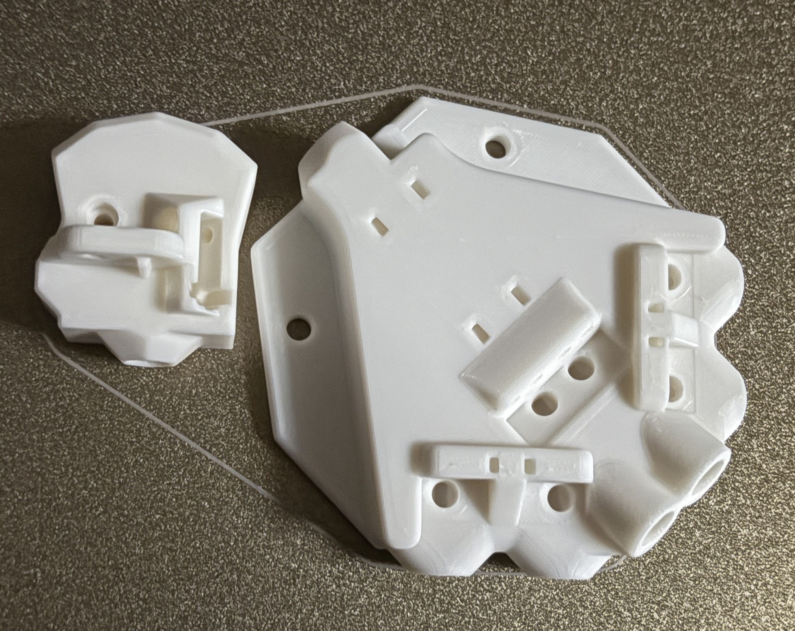

# Hardware upgrades/MODs
These are the MODs I've made to my [Siboor AWD Trident 350mm](https://www.siboor.com/product/siboor-voron-trident/)

|  Item| Description | Rating | Images |
|	--------------------	|	--------------------	| --------------------	|	--------------------	|
|  [CM4 4GB/32GB](https://www.seeedstudio.com/Raspberry-Pi-Compute-Module-CM4104032-p-4722.html) | Got this to try to avoid all the Timer Too Close MCU fails and have enough resources to manage two webcams and have more onboard storage than the CB2 offering. | :star::star::star: |   |
| TMC5160Pro drivers | | |   |
| 48v 200W PSU for X/Y motors | | |  |
| 5v 15W PSU dedicated for chamber LEDs and powered USB | | |  |
| [USB hub](https://www.amazon.com/dp/B0CWNPTH8F?ref=ppx_yo2ov_dt_b_fed_asin_title) | | :star::star: |  |
| [Logitech C920](https://www.amazon.com/dp/B085TFF7M1?ref=ppx_yo2ov_dt_b_fed_asin_title&th=1) (x2) | Specs: 1080p/30fps and 78' fov | :star::star: |  |
| [Printables Corner Mount STL](https://www.printables.com/model/1101887-logitech-c920-2020-corner-mount) | | :star::star::star: |  |
| [BTT K-Touch wireless screen](https://www.amazon.com/dp/B0D4YTSLDZ?ref=ppx_yo2ov_dt_b_fed_asin_title) | | :star::star: |  |
| Annex-Eng panel clips(https://github.com/Annex-Engineering/Annex-Engineering_User_Mods/tree/main/Printers/All_Printers/annex_dev-Panel_2020_Clips_and_Hinges) | - Top / Back panel using 5.0mm
    Back panel used 3mm foam tape so needs thicker clips too (use 3.5mm for back if using stock 1mm foam)
  - Side panels using 5.5mm | |       |
| [Network keystone](https://www.amazon.com/dp/B0116T7XMQ?ref=ppx_yo2ov_dt_b_fed_asin_title&th=1) | | :star::star::star: |  |
| [USB keystones](https://www.amazon.com/dp/B078935SFG?ref=ppx_yo2ov_dt_b_fed_asin_title&th=1) | | :star::star::star: |  |
| [270mm Disco LED sticks](https://www.siboor.com/product/voron-2-4-v2-4-3d-printer-daylight-disco-on-a-stick-pcb-kits-5v-lamp-bar-270-158mm-for-voron-0-1-0-2-2-4-trident-350-300-250mm/) (x4) | 270mm WS2812B 18-LED light bar | :star::star::star: |   |
| [LED Bar Clip Misumi v2](https://github.com/VoronDesign/VoronUsers/blob/main/printer_mods/eddie/LED_Bar_Clip/LED_Bar_Clip_Misumi_version2.stl) | Need to size up 10% to fit the Disco LEDs I got and to fit snug in 2020 extrusion | :star::star::star: |  |
| Rear motor flip | | :star::star::star: |  |
| Additional Temp sensors |  - Top chamber
 
  
  
[STL for 2020 mount](https://mods.vorondesign.com/details/dfRX88k7wwS6tpYlvyCEw)

  
     
  - Bottom chamber
    
    
    
  - Electronics bay
    
    
  | XOL toolhead

  - Rapido2 UHF PT1000

  

  [Rapido2 UHF PT1000](https://www.phaetus.com/products/rapido2?variant=45177211060501)
    
  - G2SA extruder

  

  [Galileo 2 Stand Alone](https://github.com/JaredC01/Galileo2/tree/main/galileo2_standalone)
    
  - Drag chain mount

  

  [XOL EBB36 + G2SA drag chain mount](https://www.printables.com/model/794851-xol-horizontal-drag-chain-ebb36-for-g2sa)
    
  - Cartographer mounts
    Printed 4.5mm spacers for the bottom to setup the cartographer with proper 2.5mm-3.0mm spacing up from nozzle.

| Horizontal drag chain elim and move to umbilical
 - Frame PG7 mount
   
  [PG7 2020 mount](https://www.printables.com/model/1099507-voron-trident-pg7-mount-bracket)

   
   
 - EBB36 PG7 mount

   [EBB36 PG7 mount](https://www.printables.com/make/2268162)

  

 - PTFE bend support

  [PTFE bend support](https://www.printables.com/make/2268145)
   
 - Final view
   

| Internal spool holder
[Internal Spool Holder](https://www.printables.com/model/1105610-spring-loaded-internal-spool-holder)

| Filament combiner

[Armored Turtle 4-to-1 Filament Hub](https://github.com/ArmoredTurtle/BoxTurtle/blob/main/STLs/Legacy/%5Ba%5D_hub_D2F.stl)

| Voron Top X-Handles

[Voron Strengthened X Handles](https://www.printables.com/model/1053718-strengthened-voron-x-handles)

