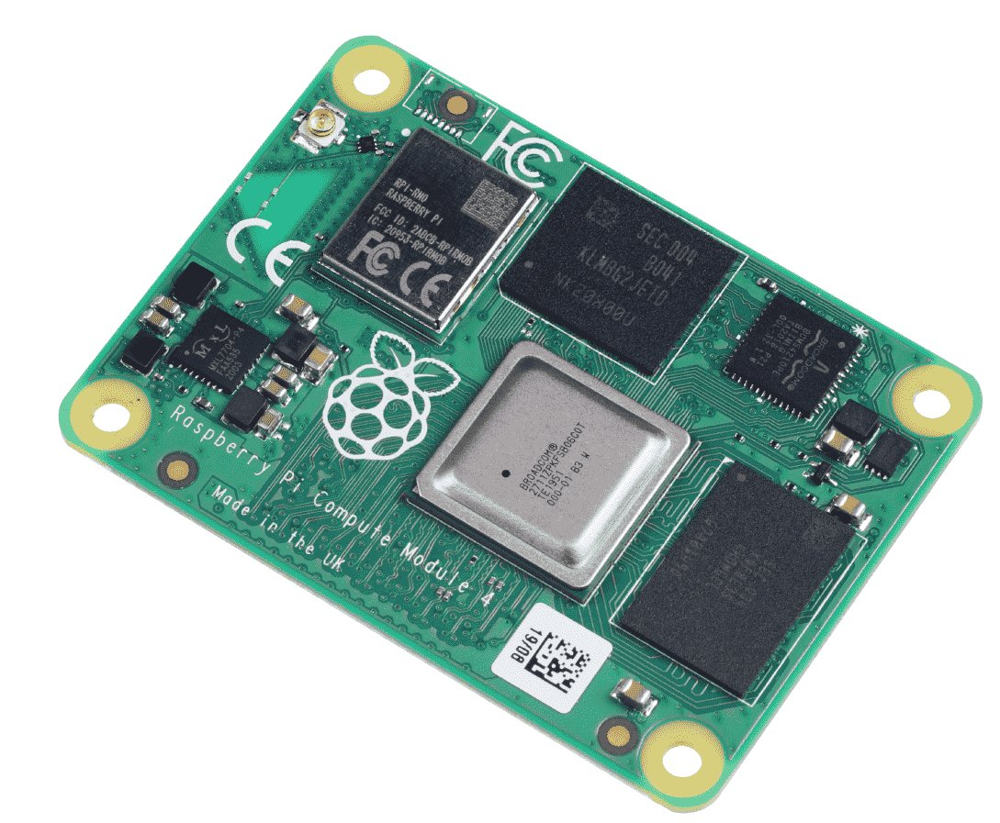

# Hardware upgrades/MODs
## CM4 4GB/32GB
  
  
  
## TMC5160Pro drivers
  
  
  
## 48v 200W PSU for X/Y motors
  
  
  
## 5v 15W PSU dedicated for chamber LEDs and powered USB
  
  
  
## USB hub (non-powered)
  
  [USB hub](https://www.amazon.com/dp/B0CWNPTH8F?ref=ppx_yo2ov_dt_b_fed_asin_title)
  
  
## Logitech C920 Webcam (x2)
  
  [Logitech C920](https://www.amazon.com/dp/B085TFF7M1?ref=ppx_yo2ov_dt_b_fed_asin_title&th=1)
  
  
  
  - specs
    - 1080p/30fps
    - 78' FOV
  - Internal corner mount STL
    
  [Printables Corner Mount STL](https://www.printables.com/model/1101887-logitech-c920-2020-corner-mount)
  
    
## BTT K-Touch
  
  [BTT K-Touch wireless screen](https://www.amazon.com/dp/B0D4YTSLDZ?ref=ppx_yo2ov_dt_b_fed_asin_title)
  
  
## Annex-Eng panel clips
  - Top / Back panel using 5.0mm
    Back panel used 3mm foam tape so needs thicker clips too (use 3.5mm for back if using stock 1mm foam)
  - Side panels using 5.5mm
  
  
  
  
  
## Network & USB keystones

## Disco LED sticks for chamber (x4)

270mm WS2812B 18-LED light bar.

[270mm Disco LED sticks](https://www.siboor.com/product/voron-2-4-v2-4-3d-printer-daylight-disco-on-a-stick-pcb-kits-5v-lamp-bar-270-158mm-for-voron-0-1-0-2-2-4-trident-350-300-250mm/)

[LED Bar Clip Misumi v2](assets/LED_Bar_Clip_Misumi_version2.stl)

## Rear motor flip

    
## Additional Temp sensors
  - Top chamber
 
  
  
[STL for 2020 mount](https://mods.vorondesign.com/details/dfRX88k7wwS6tpYlvyCEw)

  
     
  - Bottom chamber
    
    
    
  - Electronics bay
    
    
    
## XOL toolhead
  - G2SA extruder
  - Drag chain mount
  - Cartographer mounts
## Horizontal drag chain elim and move to umbilical
## Internal spool holder
## Filament combiner
## Voron Top X-Handles
