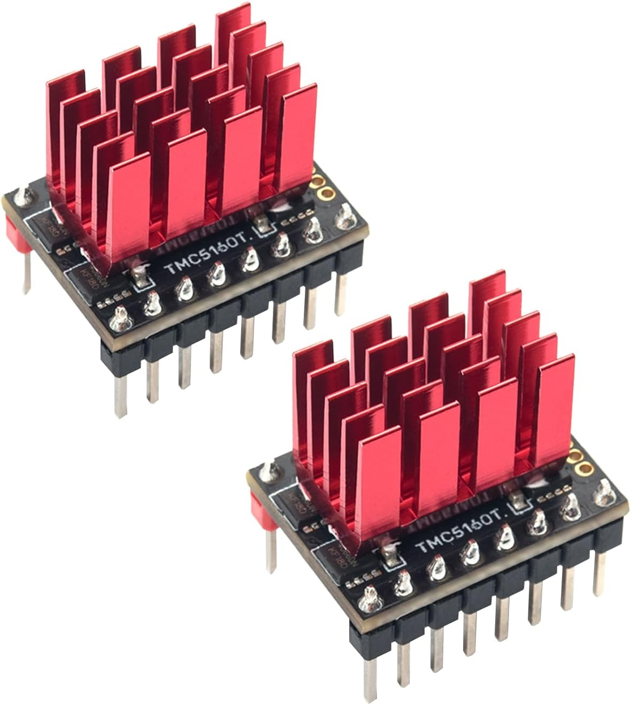
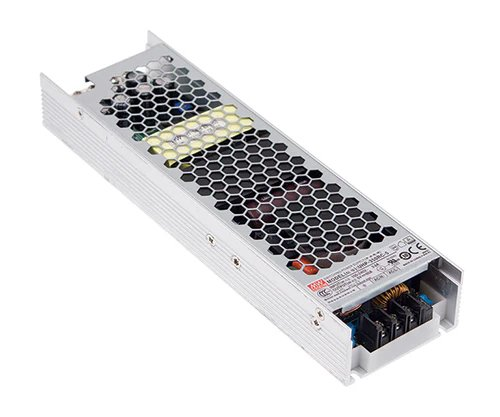
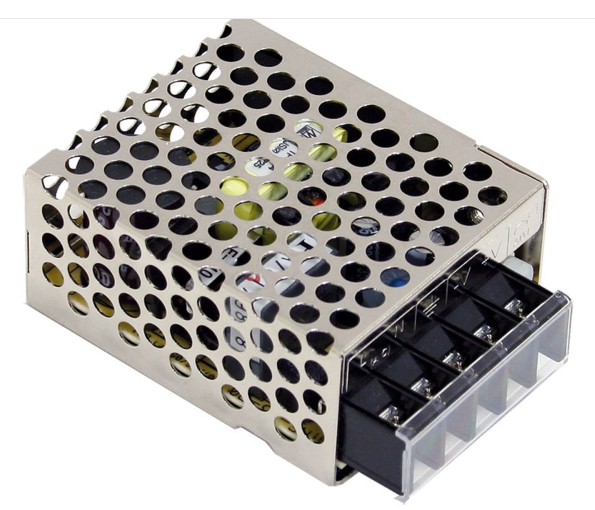
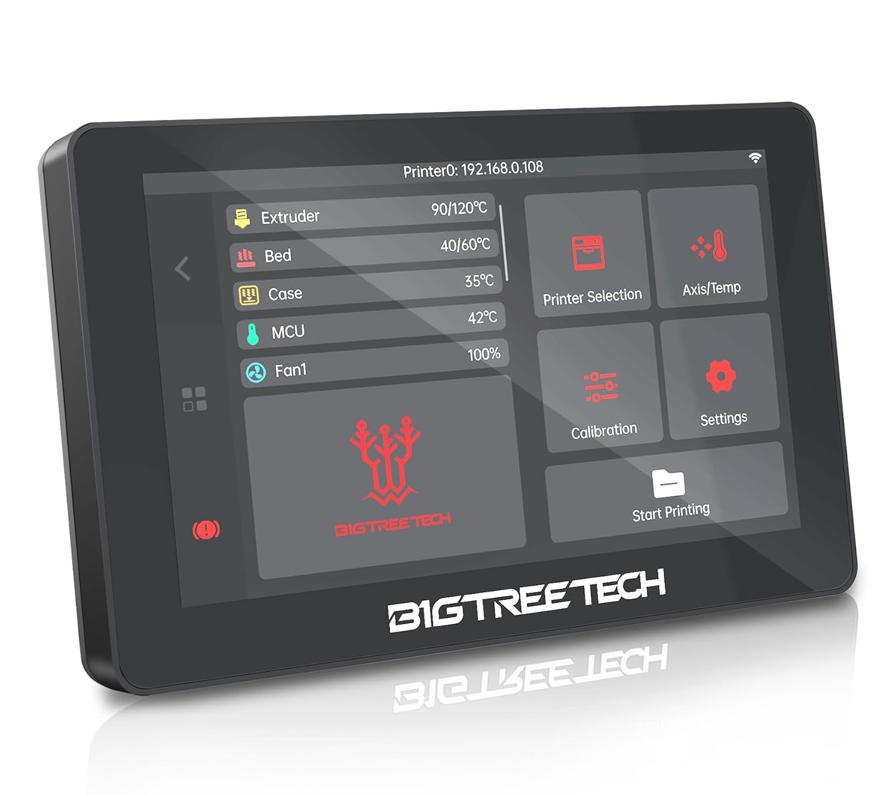
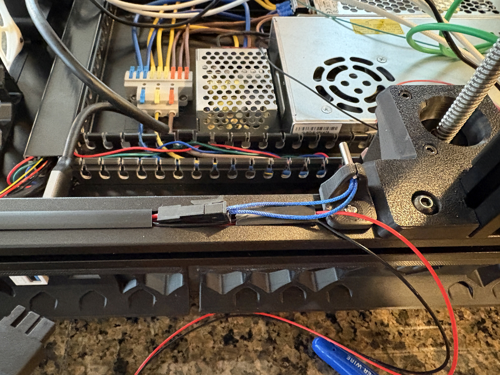
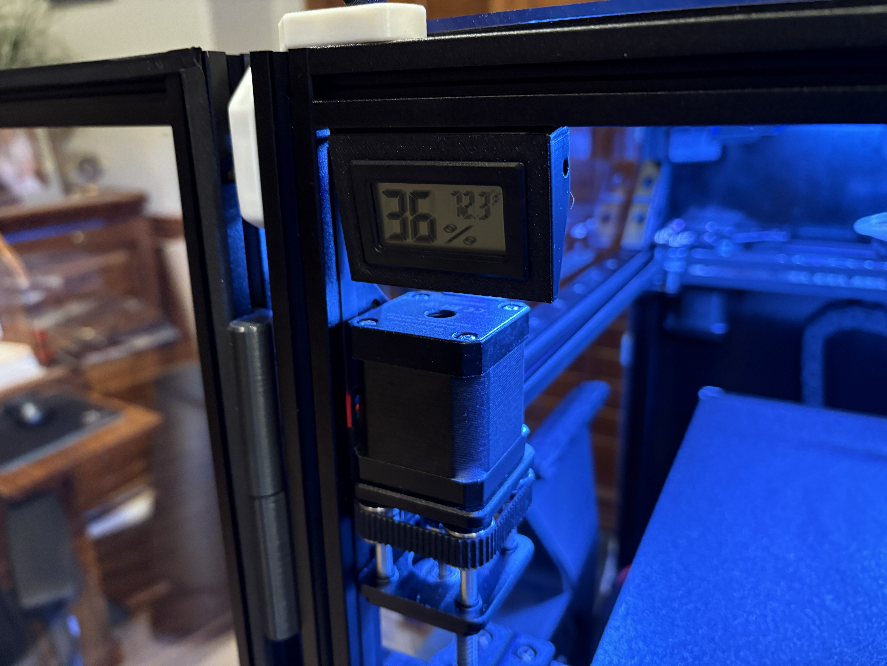
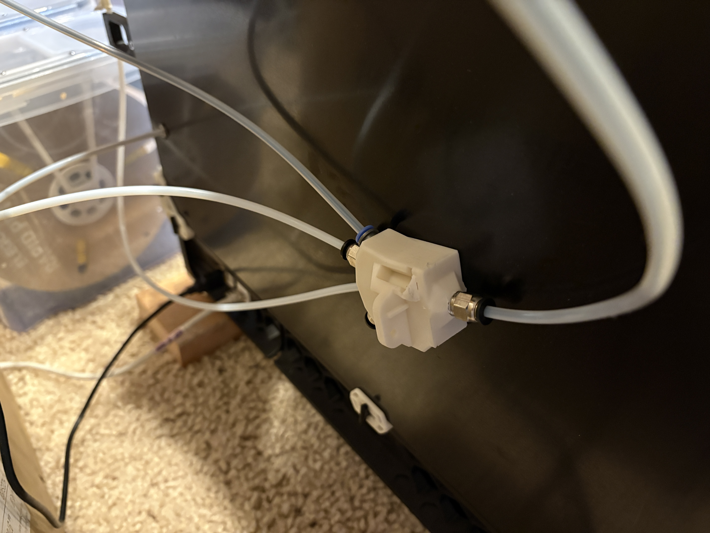
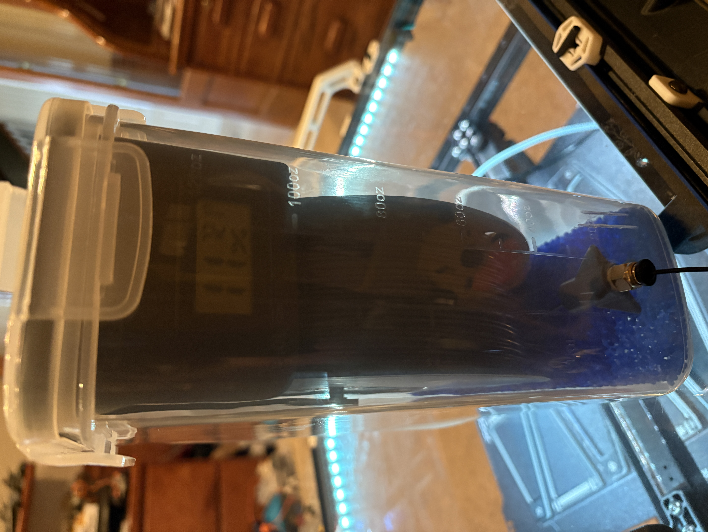

# Hardware upgrades/MODs
These are the MODs I've made to my [Siboor AWD Trident 350mm](https://www.siboor.com/product/siboor-voron-trident/)

| Item| Description | Rating | Images |
|	------------------	|	----------------------------	| ------------	|	-------------------------------------------------------------	|
| [CM4 4GB/32GB](https://www.seeedstudio.com/Raspberry-Pi-Compute-Module-CM4104032-p-4722.html) | Got this to try to avoid all the Timer Too Close MCU fails and have enough resources to manage two webcams and have more onboard storage than the CB2 offering. So far, once I eliminated the [LED Effects](https://github.com/julianschill/klipper-led_effect) plug-in module, which was causing massive TTC failures on both the Manta MCU and EBB36 MCU, it has handled everything like a champ. | :star::star::star::star: |   |
| [TMC5160T Pro drivers](https://www.amazon.com/BIGTREETECH-TMC5160T-High-Speed-Printing-Heatsink/dp/B09JS5YDQN/ref=sr_1_2) | Really good higher power drivers to support 48v | :star::star::star::star: |   |
| [48v 200W PSU](https://west3d.com/products/mean-well-uhp-200-48-200w-48v-4-2a-power-supply-psu-1?_pos=1&_sid=3af408982&_ss=r) | HV supply for X/Y motors to run at 48v | :star::star::star::star: |  |
| [5v 15W PSU](https://www.amazon.com/gp/product/B005T6UJBU/ref=ppx_yo_dt_b_search_asin_title?ie=UTF8&psc=1) | Simple PSU for dedicated supply to chamber LEDs and a powered USB hub. Probably needed a little more than just 15W out of this to get better rating. | :star::star::star: |  |
| [USB hub](https://www.amazon.com/dp/B0CWNPTH8F?ref=ppx_yo2ov_dt_b_fed_asin_title) | Simple and small hub expansion. Wish it was powered (may hack it to add in 5V supply).  And, after fighting with my two USB webcams, it makes sense that you can't just run them on a hub and expect USB 2.0 bandwidth to be able to be "split" for the additional stream.  Luckily, I figured out that the Manta M8p v2 has 3x USB 2.0 ports.  Just one of them is a dedicated plug (not USB A) on the motherboard.  So, I'm going to wire this HUB into that and let the webcams play on their own ports. | :star::star::star: |  |
| [Logitech C920](https://www.amazon.com/dp/B085TFF7M1?ref=ppx_yo2ov_dt_b_fed_asin_title&th=1) (x2) | Specs: 1080p/30fps and 78' FoV.  This really needs more like 100' FoV and fixed focus and it would be better, but color and low light works well. | :star::star: |   |
| [Printables Corner Mount STL](https://www.printables.com/model/1101887-logitech-c920-2020-corner-mount) | 2020 Extrusion corner mount for Logitech C920 I designed | :star::star::star::star: |   |
| [IMX307 1080p bare camera](https://www.aliexpress.us/item/3256806095943563.html?spm=a2g0o.order_list.order_list_main.5.3b661802veMv1n&gatewayAdapt=glo2usa) (x2) | Specs: 1080p/60fps and 100' FoV.  This bare bones 38mmx38mm board without any autofocus and a wider FoV was latest pick for chamber webcam. | :star::star::star: |  |
| [Printables 2020 Corner Mount for IMX307]() | 2020 Extrusion corner mount for IMX307 bare board with 45' down-tilt, which I designed | :star::star::star::star: |   |
| [BTT K-Touch wireless screen](https://www.amazon.com/dp/B0D4YTSLDZ?ref=ppx_yo2ov_dt_b_fed_asin_title) | Wireless battery powered display works, but needs better firmware support to add more features more like KlipperScreen. I got it on black Friday sale, and it "works" but just waiting for them to maybe improve the firmware. | :star::star: |  |
| [Annex-Eng panel clips](https://github.com/Annex-Engineering/Annex-Engineering_User_Mods/tree/main/Printers/All_Printers/annex_dev-Panel_2020_Clips_and_Hinges) | **Top & Back** panel using 5.0mm with 3mm foam tape (use 3.5mm clips for back if using stock 1mm foam).  **Side** panels using 5.5mm clips with 3mm foam | :star::star::star::star::star: |     |
| [Network keystone](https://www.amazon.com/dp/B0116T7XMQ?ref=ppx_yo2ov_dt_b_fed_asin_title&th=1) | Doesn't fit in printed square slot great, but I think that is a problem with skirt model | :star::star::star::star: |   |
| [USB keystones](https://www.amazon.com/dp/B078935SFG?ref=ppx_yo2ov_dt_b_fed_asin_title&th=1) | Doesn't fit in printed square slot great, but I think that is a problem with skirt model | :star::star::star::star: |  |
| [270mm Disco LED sticks](https://www.siboor.com/product/voron-2-4-v2-4-3d-printer-daylight-disco-on-a-stick-pcb-kits-5v-lamp-bar-270-158mm-for-voron-0-1-0-2-2-4-trident-350-300-250mm/) (x4) | 270mm WS2812B 5v 18-LED light bar. Needs VCC/GND solder pads at other end too | :star::star::star: |   |
| [LED Bar Clip Misumi v2](https://github.com/VoronDesign/VoronUsers/blob/main/printer_mods/eddie/LED_Bar_Clip/LED_Bar_Clip_Misumi_version2.stl) | Need to size up 10% to fit the Disco LEDs I got and to fit snug in 2020 extrusion. Also, slot makes it difficult to fit pass on wiring through. | :star::star::star: |  |
| Rear motor flip | Easy to do, and required for XOL toolhead clearance | :star::star::star: |  |
| Additional Temp sensors | One at **TOP** of chamber and one at **Bottom** plus x1 in electronics bay near drivers. | :star::star::star::star: |    |
| [Thermistor 2020 mount](https://mods.vorondesign.com/details/dfRX88k7wwS6tpYlvyCEw) | great 3mm t-nut mount for thermistor.  Might be a little bulkier than necessary. | :star::star::star::star: |  |
| [Digital Humidity Sensor](https://www.amazon.com/gp/product/B0CXHS6CYS/ref=ppx_yo_dt_b_search_asin_title) | Good digital temp/humidity sensors for your filament storage boxes and for a low tech quick chamber temp/humidty reading. | :star::star::star::star: |  |
| [Digital Humidity Sensor 2020 Mount](https://www.printables.com/model/1113476-temp-humidity-sensor-2020-bracket) | Mount for common digital thermomenter/hygrometer I designed. | :star::star::star::star: |   |
| [XOL toolhead](https://github.com/Armchair-Heavy-Industries/Xol-Toolhead) | Ugly, but light and very functional print head with lots of extruder/hotend support. I would like a little more powerful fans (may need to look into higher RPM Delta fans) | :star::star::star::star: |  |
| [Rapido2 UHF PT1000](https://www.phaetus.com/products/rapido2?variant=45177211060501) Hotend | Great Ultra High Flow with 0.4mm and 0.6mm Hardened nozzles | :star::star::star::star: |  |
| [EBB36 Toolhead Board](https://github.com/bigtreetech/EBB) | Pretty typical board for this toolhead. Documentation could have been more clear and better, especially for PT1000 sensor pins. I **also** am frustrated that the included PT1000 secondary sensor doesn't work if using the main one. | :star::star::star::star: |  |
| [Galileo 2 Stand Alone](https://github.com/JaredC01/Galileo2/tree/main/galileo2_standalone) Extruder | Really happy with this large extruder. Pulls hard and single gear with idler design, so should avoid some of the binding extrusion artifacts | :star::star::star::star: |  |
| [Stainless Steel 4mmOD / 2mmID capilary tube](https://www.amazon.com/dp/B0C5QZ28F2?ref=ppx_yo2ov_dt_b_fed_asin_title&th=1) | I was having problems with the 2mmID PTFE tube in the toolhead between the extruder and the Rapido2.  I had originally a 32.6mm PTFE length section though the XOL build site didn't have Galileo2 to Rapido2 measurement, they said 43mm for Rapido/Orbiter2.0.  I test fit longer ones and trimmed to have it just fit and 35mm seemed to fit.  Cut some stainless steel tubing (4mmOD/2mmID) to 34.78mm and drilled it out to 2mm, just to deburr it.  Lightly reamed out the opening on the extruder side to help funnel filament in.  Got it to feed in fine (better than the PTFE), so now just see how it does longer term.  Likely the shorter than needed PTFE tube was the reason it got damaged and hung up to begin with.  Test fitting originally, that was as long as I could get, but sounds like the ASA print tapers a bit and probalby I wasn't as far up as I needed.  Unfortunate that there wasn't a good PTFE length on [the XOL GIT table](https://github.com/Armchair-Heavy-Industries/Xol-Toolhead/blob/main/docs/PTFE_Length.md).  I need to conduct some tests to see if it is possible to get melted filament stuck in the SS tube compared to PTFE (likely PLA or TPU will be worst and trying to back out an appreciable amount to sit in the SS tube quickly and cool that way).  *Update* well, filament doesn't seem to "stick" to the stainless however, you CAN get a balled up filament end that doesn't pull out through the stainless 2mm hole and WON'T go back into the hotend to melt if you mess around too much moving it in/out of the cool stainless.  LoL.  Also, I have found that the 43mm *is* closer to reality.  You just have to shove the tube REALLY HARD.  The layer lines sort of keep it from sliding all the way in/up but if you push it pretty good, you can get all of 42.3mm in there and THAT seems to do much better at not getting stuck (likely because it doesn't have a big gap now... | :star::star::star::star: |    |
| [XOL EBB36 + G2SA drag chain mount](https://www.printables.com/model/794851-xol-horizontal-drag-chain-ebb36-for-g2sa) | Needed some modification to fit my chain plus, it needed to sit higher on the toolhead. | :star::star::star: |  |
| Cartographer mounts | Printed 4.5mm spacers for the bottom to setup the cartographer with proper 2.5mm-3.0mm spacing up from nozzle. | :star::star::star: |  |
| **Horizontal drag chain elim and move to umbilical** [PG7 2020 mount](https://www.printables.com/model/1099507-voron-trident-pg7-mount-bracket) | Good mount for the PG7 cable in the 2020 corner | :star::star::star::star: |  |
| **Horizontal drag chain elim and move to umbilical** [EBB36 PG7 mount](https://www.printables.com/make/2268162) | Good mount for the XOL toolhead on G2SA + EBB36 board for PG7 | :star::star::star::star: |  |
| [PTFE bend support](https://www.printables.com/make/2268145) | Keeps PTFE tube from bending/collapsing | :star::star::star: |   |
| [Internal Spool Holder](https://www.printables.com/model/1105610-spring-loaded-internal-spool-holder) | Spring tensioned Internal 1Kg spool holder with rollers. I need to redesign it a touch to allow spring mount bolts to be recessed because it interferes with electronics bay panel removal as it is. | :star::star::star::star:|   |
| [Armored Turtle 4-to-1 Filament Hub with Runout Sensor](https://github.com/ArmoredTurtle/BoxTurtle/blob/main/STLs/Legacy/%5Ba%5D_hub_D2F.stl) | Works to combine up to 4 sources, I've "upgraded" to the legacy version of this hub, which has support for the more standard and available micro switch. Seems like Klipper expects your Endstop switches to be pulled logically to GND (you can't pull to VCC and just invert the logic). | :star::star::star::star: |   |
| [Voron Strengthened X Handles](https://www.printables.com/model/1053718-strengthened-voron-x-handles) | If you want/need handles on the top to lift | :star::star::star::star: |  |
| [Filament Dry Box spool holders](https://www.printables.com/model/983885-modular-minimal-filament-drybox-with-no-bearings-r) | Good hanger system for inside 4L dry cereal boxes to store filament and spool out of | :star::star::star::star: |    |
