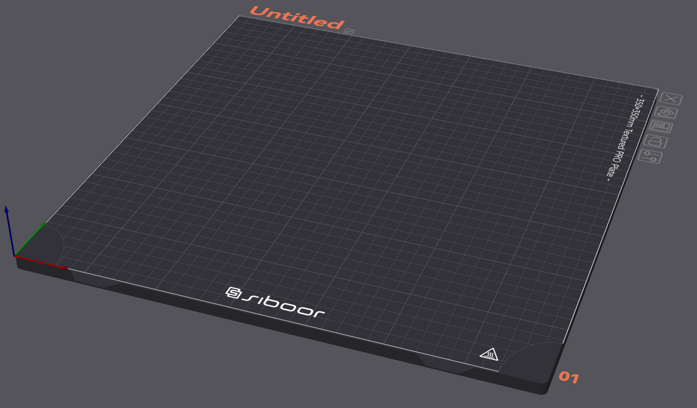

# Software upgrades/MODs
| Item | Description | Images |
| --------------- | ----------------------------------------------------- | ----------------------------------------------------- |
| [Crowsnest](https://github.com/mainsail-crew/crowsnest) | Good webcam manager plug-in for moonraker | |
| [Spoolman](https://github.com/Donkie/Spoolman) | Excellent filament spool manager database that integrates into printer to monitor usage (works in Fluidd and Mainsail) | |
| [Timelapse](https://github.com/mainsail-crew/moonraker-timelapse) | Good plugin for moonraker that allows time lapse footage per layer as well as parked head snapshots (Fluidd and Mainsail supported) | |
| Orca Slicer Custom Bedmap | Created a custom bedmap for the XOL front AWD keep out area. |  |
| [SAMBA setup Guide](https://pimylifeup.com/raspberry-pi-samba/) | Adding a SAMBA share to your CB2/CM4/RPi4 main processor makes it easy to share with windows file mounts.  I'm using this to allow me to directly edit/push/sync to GIT. | |
