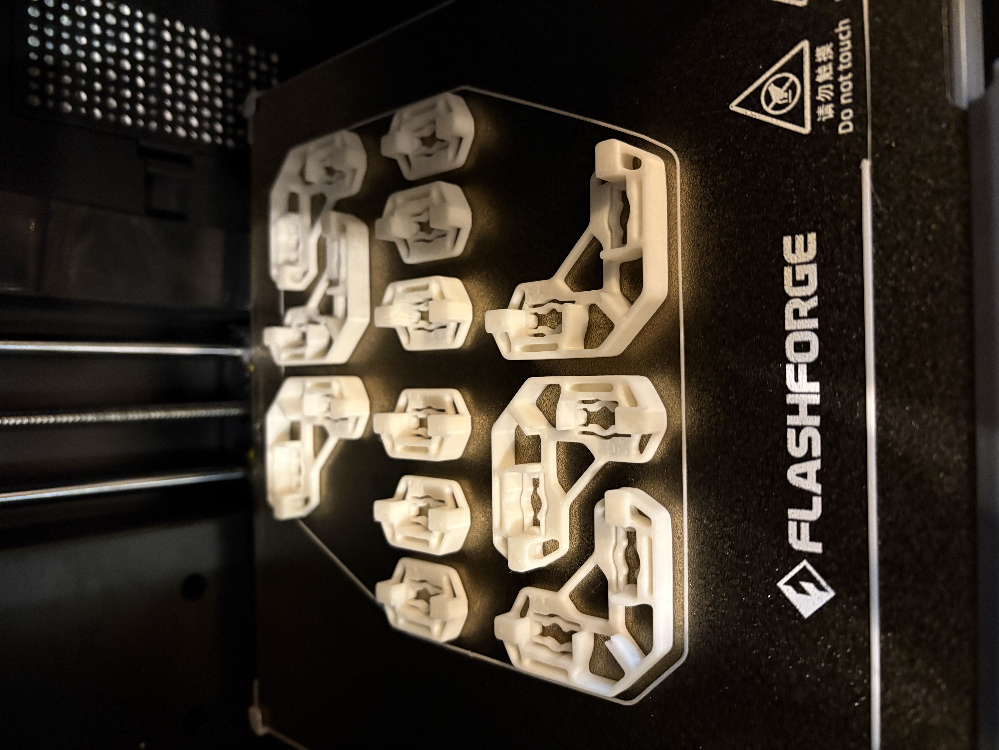

This will document the build and MODS to my [Siboor AWD Trident 350mm](https://www.siboor.com/product/siboor-voron-trident/)
# The build
- Manta M8p and CM4 prep
  
  
- frame
- gantry
- bed
- electronics
- panels
- misc
# Hardware upgrades/MODs
- CM4 4GB/32GB
  
- TMC5160Pro drivers
  
- 48v 200W PSU for X/Y motors
  
- 5v 15W PSU dedicated for chamber LEDs and powered USB
  
- USB hub (non-powered)
  [USB hub](https://www.amazon.com/dp/B0CWNPTH8F?ref=ppx_yo2ov_dt_b_fed_asin_title)
  
- Logitech C920 Webcam (x2)
  [Logitech C920](https://www.amazon.com/dp/B085TFF7M1?ref=ppx_yo2ov_dt_b_fed_asin_title&th=1)
  
  - specs
    - 1080p/30fps
    - 78' FOV
  - Internal corner mount STL
    
- BTT K-Touch
  [BTT K-Touch wireless screen](https://www.amazon.com/dp/B0D4YTSLDZ?ref=ppx_yo2ov_dt_b_fed_asin_title)
  
- Annex-Eng panel clips
  - Top / Back panel using 5.0mm
    Back panel used 3mm foam tape so needs thicker clips too (use 3.5mm for back if using stock 1mm foam)
  - Side panels using 5.5mm
  
  
  
- Network & USB keystones
- Disco LED sticks for chamber (x4)
- Rear motor flip
- Additional Temp sensors
  - Top chamber
     show STL for 2020 mount
  - Bottom chamber
  - Electronics bay
- XOL toolhead
  - G2SA extruder
  - Drag chain mount
  - Cartographer mounts
- Horizontal drag chain elim and move to umbilical
- Internal spool holder
- Filament combiner
- Voron Top X-Handles
# Software upgrades/MODs
- samba
- crowsnest
- spoolman
- timelapse
